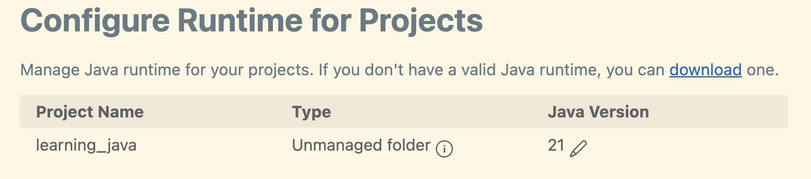

# Java set up for MacOS

- As a VSCode user, I decided to use Java within VSCode
- Lightweight installation tutorial [https://code.visualstudio.com/docs/java/java-tutorial](https://code.visualstudio.com/docs/java/java-tutorial)
- TLDR
    1. Install the Extension Pack for Java
    2. It will prompt you to install a JDK (Java development kit) - I ended up installing Eclipse Adoptium's Temurin
    3. Create a new file called QuickStart.java with Hello world code snippet
        ```
        class QuickStart {
            public static void main (String[] args) {
                // This is a comment
                System.out.println("Hello, World.");
            }
        }
        ```
    4. F5 to run and debug in VSCode's terminal

- To check which version of Java you are running from VSCode:

  * Open a Java project folder and press Command+Shift+p to open Command Palette and type Java configure java runtime.
  
   
  * Java projects + versions used show up
  

# References
- [University of Helinski's MOOC](https://java-programming.mooc.fi/)
- Effective Java by Joshua Bloc